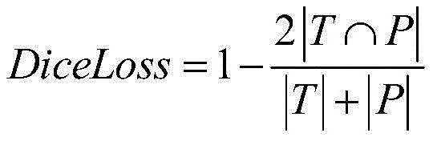
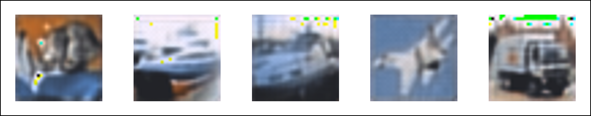
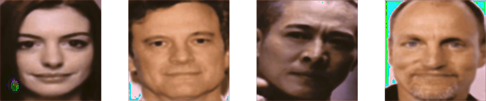

# UNet_denoise
This post present a simple way to purify the adversarial examples.

## Unet
UNet is a deep learning architecture commonly used for image segmentation tasks in the field of computer vision and medical image analysis. It was introduced by Olaf Ronneberger, Philipp Fischer, and Thomas Brox in their 2015 paper titled "[U-Net: Convolutional Networks for Biomedical Image Segmentation](https://arxiv.org/abs/1505.04597)."

The name "UNet" is derived from its U-shaped architecture. The network is designed to take an input image and produce a pixel-wise segmentation map as its output, where each pixel in the input image is classified into one of several predefined classes or categories. It's particularly popular in biomedical image segmentation tasks, such as identifying and segmenting objects like cells or organs within medical images.

UNet has been widely adopted in various image segmentation tasks beyond biomedical imaging and has served as a foundational architecture for more advanced models. Researchers have also proposed several variations and improvements to the original UNet architecture to address specific challenges in different applications.

## Dice Loss
Dice Loss is a loss function commonly used in image segmentation tasks, especially in medical image analysis and computer vision. It is named after the Dice coefficient, also known as the Sørensen-Dice coefficient, which is a similarity metric used to measure the overlap between two sets.

The Dice Loss is designed to optimize the performance of models by encouraging accurate segmentation of objects within an image. It is particularly useful when dealing with imbalanced datasets, where certain classes or objects may be much less common than others.

The Dice Loss is defined as follows:

 

## Experiments

**Cifar10** : 
 

**Casia** :
 